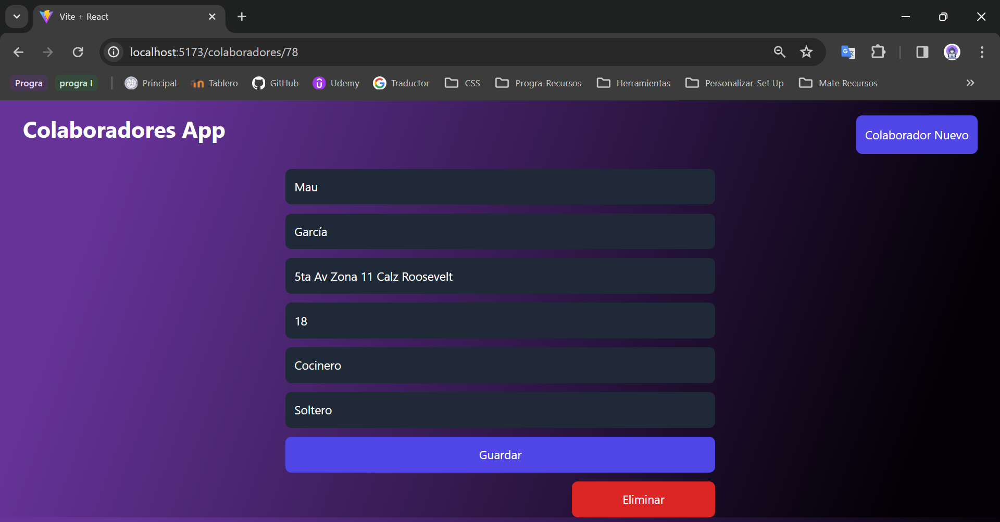

---
---

# Manual de Usuario
# COLABORADORES - APP

---

Software Engineer - Edison García

---
---

## Introducción
El software de COLABORADORES-APP fue desarrollado mediante el lenguaje de programación HTML5, CSS3, Javascript y el framework de React con Vite, modelado con Tailwind CSS, por el lado del Frontend; el Backend fue desarrollado con Python, Django y la extensión de Django Rest Framework para la creación eficiente y ágil de Colaboradores-App, conectada a la base de datos a través de MySql. Por lo que permite agregar datos del colaborador, datos como: nombre, apellidos, edad, dirección, profesión y estado civil.  De igual manera estos datos se pueden visualizar a través de una tabla, la cual contiene 2 botones: **Editar**, que permite cambiar y modificar datos del colaborador añadido recientemente y el botón de **Nivel de Riesgo** que muestra una advertencia dependiendo de la edad para permitirle salir, no salir y salir de manera responsable de su residencia.

## Características
### A. Ventana Principal
A continuación se muestra una imagen donde se puede visualizar el entorno de la interfaz del software COLABORADORES - APP:

### B. Agregar Colaboradores
Esta opción nos permite agregar nuevos colaboradores con los datos correspondientes que nos van solicitando los campos de texto.

**Botón Guardar**

### C. Botón Editar
Al presionar este botón el sitio nos permite modificar cualquier dato del colaborador, a su misma vez podemos **guardar** o **eliminar** los datos de dicho colaborador.

**Botón Eliminar**

### D. Botón Nivel de Riesgo
De igual manera al presionar el botón de **Nivel de Riesgo** como se había descrito anteriormente este nos permite visualizar una advertencia dependiendo la edad para poder salir >=18 y <=25>, salir con las medidas necesarios o no salir de casa.  Esto para evitar cualquier riesgo a la vida del colaboradore.  Maxime si es mayor de edad, por lo que se le solicita que se quede en casa.

**Rango >=18 y <=25 ¡FUERA DE PELIGRO!**

**Rango >=26 Y <=50 ¡TENGA CUIDADO, TOME TODAS LAS MEDIDAS DE PREVENCIÓN!**

**Rango >=51 ¡POR FAVOR QUEDARSE EN CASA!**

### E. Extras

Cuenta con varias animaciones y la que destaca es la del cursor al moverlo sobre la tabla cualquiera de las filas se visualiza de manera más dinámica.

